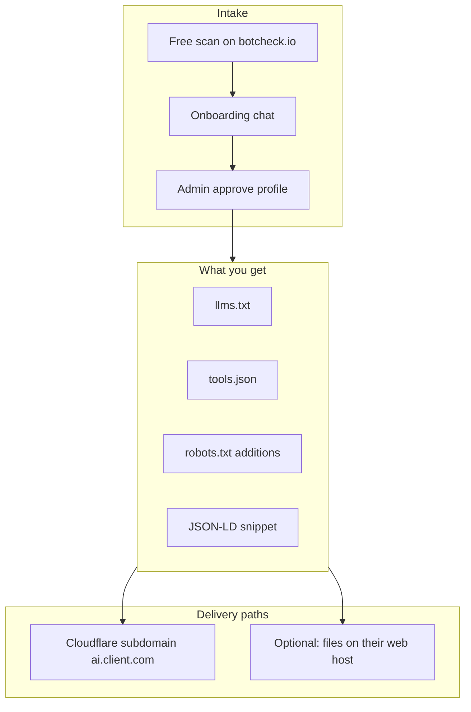
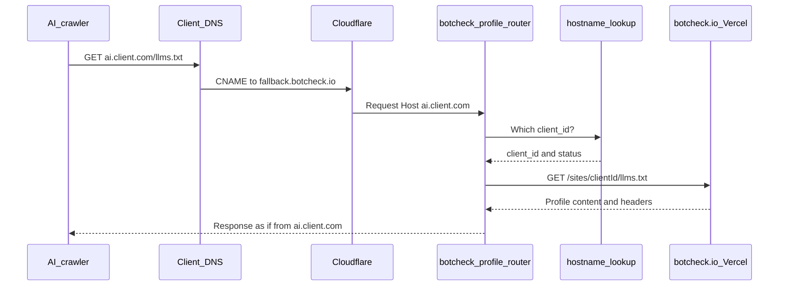

# Agency delivery guide — how BotCheck works end to end

This document explains **what the app produces**, **how you deliver it to a client**, and **exactly what their DNS record does**. For a short checklist, see `[agency-sop.md](agency-sop.md)`. For one-time platform setup, see `[DEPLOY.md](DEPLOY.md)`.

**Your console:** `https://www.botcheck.io/admin`

---

## 1. Overview — what you deliver to each client

For every client you run one workflow with two proof points:

1. **Agent Readiness Score** — a measured before/after scan (same engine as the public scan on botcheck.io / isitagentready.com).
2. **AI discovery files** — structured content so AI agents can find hours, services, booking, and pricing.

You also optionally record **brand visibility** (how often ChatGPT, Claude, etc. mention the business in test prompts).




### Files generated during onboarding

After the client (or you) completes the onboarding chat, Claude builds a profile stored in Supabase:


| Asset                    | Purpose                                                                         |
| ------------------------ | ------------------------------------------------------------------------------- |
| **llms.txt**             | Plain-text business summary for AI agents (hours, services, policies)           |
| **tools.json**           | JSON array of actions/services agents can invoke (book, call, pricing pages)    |
| **robots.txt additions** | Lines to **append** to their existing robots.txt — never replace the whole file |
| **JSON-LD snippet**      | Schema.org `LocalBusiness` block for their homepage `<head>`                    |


The app also serves these **at request time** from the approved profile (no separate upload):


| Surface        | Purpose                                                               |
| -------------- | --------------------------------------------------------------------- |
| **index.json** | Machine-readable index pointing at llms.txt, tools.json, jsonld       |
| **jsonld**     | Full JSON-LD document (same data as the snippet, as a standalone URL) |


All hosted URLs include the header `Content-Signal: ai-input=yes, search=yes, ai-train=no` so compliant crawlers know the content is intended for AI input and search, not training.

### Two delivery paths (both can apply)


| Path                                                   | Required?                       | Who does the work                                |
| ------------------------------------------------------ | ------------------------------- | ------------------------------------------------ |
| **Cloudflare custom hostname** (`ai.clientdomain.com`) | **Yes — every client**          | You register in admin; client adds one CNAME     |
| **On-site files** (root domain)                        | Only if you have hosting access | You copy files from Deploy panel into their site |


Cloudflare and on-site are **additive**. Cloudflare gives you a branded subdomain you control centrally. On-site helps crawlers that only look at `theirdomain.com/llms.txt`.

---

## 2. Where files live — three URL patterns

Understanding these three patterns prevents confusion about “which URL is live.”


| URL pattern                                         | Who uses it                           | Works when                                                     |
| --------------------------------------------------- | ------------------------------------- | -------------------------------------------------------------- |
| `https://www.botcheck.io/sites/{clientId}/llms.txt` | You (verification), Worker (upstream) | Profile **approved** in admin (`status: live`)                 |
| `https://ai.{clientdomain}.com/llms.txt`            | Client, AI crawlers on their brand    | Hostname **registered** + client **CNAME** + status **active** |
| `https://{clientdomain}.com/llms.txt`               | Crawlers on main site                 | You **uploaded** files to their web host                       |


**Supported paths on any live surface:**

- `/llms.txt`
- `/tools.json`
- `/index.json`
- `/jsonld`

On the BotCheck-hosted URL, swap `{clientId}` for the UUID from admin (visible in onboarding links and Deploy panel).

---

## 3. End-to-end workflow

### Phase A — Intake (before deploy)

**Path 1 — Client self-serve**

1. Client runs a free scan on `https://www.botcheck.io/`
2. Enters email, pays via Stripe, completes onboarding chat at `/onboarding/{clientId}`
3. You receive an email at `ADMIN_EMAIL` when the profile is ready for review
4. Open **Pending Review** in admin → **Review & edit** or **Approve**

Their funnel scan is linked as **baseline** automatically at checkout (Score column shows e.g. `42 → —`).

**Path 2 — You add the client**

1. **Admin → + Add Client** — domain, business name, contact email
2. Check **hosting access** if you can upload files to their website
3. Baseline scan runs automatically
4. Complete onboarding (on their behalf or send them `/onboarding/{clientId}`)
5. **Approve** when ready

**After approve:** profile status is `live`. The canonical URLs on botcheck.io work immediately:

```
https://www.botcheck.io/sites/{clientId}/llms.txt
https://www.botcheck.io/sites/{clientId}/tools.json
https://www.botcheck.io/sites/{clientId}/index.json
https://www.botcheck.io/sites/{clientId}/jsonld
```

### Phase B — Deploy (Deploy panel)

Open **Admin → Clients → Deploy** on the client row.


| Order | Section in Deploy panel               | What you do                                                                                |
| ----- | ------------------------------------- | ------------------------------------------------------------------------------------------ |
| 1     | **Brand visibility**                  | Run baseline prompts in Cloudflare ai-brand-visibility-template; record 0–5 model mentions |
| 2     | **Cloudflare (every client)**         | Register hostname, send DNS link, wait for **active**                                      |
| 3     | **On their site** (if hosting access) | Copy llms.txt, tools.json, robots additions, JSON-LD into their site                       |
| 4     | **Score**                             | Run **post-delivery scan**                                                                 |
| 5     | **Brand visibility**                  | Re-test; record **post-delivery**                                                          |
| 6     | **Client report (PDF)**               | Open, save as PDF, send to client                                                          |


### Phase C — Handoff

Tell the client:

- Their AI profile lives at `https://ai.{theirdomain}/llms.txt` (once DNS is active)
- You will keep it updated when their site changes (weekly monitor + your review)
- Share the PDF with before/after score and brand mention delta

---

## 4. Cloudflare DNS — what you connect and what changes

This is the most common question: **“What do I add to their DNS?”**

### What you do (admin, ~2 minutes)

1. Open **Deploy** for the client
2. In **Custom hostname**, enter e.g. `ai.midstatehealth.net` (default suggestion: `ai.{domain}`)
3. Click **Register hostname**
  - BotCheck calls Cloudflare for SaaS API
  - Stores `custom_hostname`, Cloudflare hostname ID, and status on the client row
4. Click **Copy DNS setup link for client**
  - Send them: `https://www.botcheck.io/onboarding/dns-setup/{clientId}`
  - They see copy-paste CNAME instructions and auto status polling

You can click **Check status** in the Deploy panel anytime to refresh Cloudflare verification state.

### What the client adds (one DNS record)

They add this at **their** DNS provider (GoDaddy, Cloudflare, Route53, registrar, etc.):


| Field              | Value                                                                       |
| ------------------ | --------------------------------------------------------------------------- |
| **Type**           | CNAME                                                                       |
| **Name / Host**    | `ai` (the subdomain label before their domain)                              |
| **Target / Value** | `fallback.botcheck.io` (or your `CLOUDFLARE_FALLBACK_ORIGIN` if customized) |


**Example** for hostname `ai.midstatehealth.net`:

```
Type:   CNAME
Name:   ai
Target: fallback.botcheck.io
```

Some providers want the full hostname as Name — the DNS setup page shows both the short label (`ai`) and full host (`ai.midstatehealth.net`).

**They do not need:**

- An A record
- A second TXT record for SSL (Cloudflare uses HTTP DCV automatically)
- Access to BotCheck or your Vercel app

### What the CNAME actually connects to

The client’s CNAME does **not** point at botcheck.io or Vercel directly. It points at BotCheck’s **Cloudflare fallback origin**, which runs the profile router Worker.




**Step by step:**

1. A crawler requests `https://ai.client.com/llms.txt`
2. DNS resolves `ai.client.com` → CNAME → `fallback.botcheck.io` → Cloudflare Worker
3. Worker reads the `Host` header (`ai.client.com`)
4. Worker calls Supabase edge function **hostname-lookup** → `{ client_id, status }`
5. Worker fetches `https://www.botcheck.io/sites/{clientId}/llms.txt` (canonical source)
6. Worker returns that body to the crawler as if it were served from the client’s subdomain
7. Cloudflare terminates SSL with a certificate issued for `ai.client.com`

The Worker holds **no** Supabase credentials. hostname-lookup is a narrow public endpoint.

### What changes when the CNAME goes live


| Before CNAME is active                            | After CNAME is active                                    |
| ------------------------------------------------- | -------------------------------------------------------- |
| `ai.client.com` may not resolve or returns errors | `https://ai.client.com/llms.txt` serves the live profile |
| Deploy panel hostname status: **pending**         | Status: **active**                                       |
| Client account may still be in onboarding         | Client status → **active**, `dns_verified` set           |
| No “you’re live” email                            | **Profile live email** sent to `contact_email`           |
| Profile only on `botcheck.io/sites/...`           | Same content on **client-branded subdomain**             |


**Client experience:** The DNS setup page auto-checks every 30 seconds. When active, they see “You’re live!” with a link to view their profile.

**Your verification:**

1. Deploy panel → **Check status** → **active**
2. Open `https://ai.{domain}/llms.txt` in a browser (should match botcheck.io/sites content)
3. Optionally run post-delivery scan and record brand check

### Re-registering or fixing hostname

- **Wrong subdomain entered?** Enter the correct hostname and click **Register hostname** again (old Cloudflare hostname is cleaned up best-effort)
- **Stuck pending?** Client likely has typo in CNAME, wrong target, or DNS not propagated yet — DNS setup page shows Cloudflare error detail when available
- **Worker debugging:** `cd cloudflare/worker && npx wrangler tail` while client adds DNS

---

## 5. Optional — on-site files (hosting access)

If you checked **hosting access** when adding the client, the Deploy panel shows **Copy** buttons for each asset.

### Checklist

1. Upload **llms.txt** to site root → must load at `https://theirdomain.com/llms.txt`
2. Upload **tools.json** to site root → `https://theirdomain.com/tools.json`
3. **Append** robots.txt additions to their existing robots.txt (do not replace the file)
4. Paste **JSON-LD snippet** into homepage `<head>`
5. Verify each URL is public (no login wall, no redirect loop)

### Why bother if Cloudflare already works?

Some agents and crawlers only probe the **apex domain** (`example.com/llms.txt`), not `ai.example.com`. On-site files are an extra discovery surface. You maintain Cloudflare for SSL, central updates, and the client-facing branded URL; on-site is bonus coverage when you have FTP, cPanel, or CMS access.

---

## 6. Proof and client reporting

### Agent Readiness Score


| When            | How                                           | Stored as                       |
| --------------- | --------------------------------------------- | ------------------------------- |
| Before delivery | Funnel scan or **+ Add Client** baseline scan | `clients.baseline_scan_id`      |
| After delivery  | Deploy panel → **Run post-delivery scan**     | `clients.post_delivery_scan_id` |


Admin **Score** column shows `42 → 78` when both exist. Deploy panel shows the same delta.

### Brand visibility

Everything is on the client workspace page (`/admin/client/{id}`) → **Brand visibility across LLMs**.

1. Click **Generate prompts from profile** — BotCheck uses the client's profile to draft neutral consumer questions where the business should surface.
2. Run those prompts across models. For real, no-API-key automation across GPT, Claude, Gemini, Llama, and Mistral, deploy Cloudflare's **[ai-brand-visibility-template](https://github.com/cloudflare/templates/tree/main/ai-brand-visibility-template)** (it runs prompts through Cloudflare AI Gateway). See "Deploying the brand visibility tool" below.
3. For each result, record **prompt + model + mentioned?** in the workspace (choose **Baseline** or **Post-delivery**).

Each result is stored per (prompt × model) in `brand_visibility_results`, so the client PDF shows exactly which model was asked what, and whether the business came up.

#### Deploying the brand visibility tool (one time, optional but recommended)

The `ai-brand-visibility-template` is a **separate** Cloudflare Worker app (not part of BotCheck — BotCheck runs on Vercel and can't call `env.AI`). Deploy it once, reuse for all clients:

```bash
git clone https://github.com/cloudflare/templates
cd templates/ai-brand-visibility-template
npm install
npx wrangler login
npx wrangler kv namespace create AEO_KV        # paste the ID into wrangler.jsonc
npx wrangler queues create brand-visibility-jobs
npm run deploy
```

Then set `BRAND_VISIBILITY_URL` (in Vercel + local `.env`) to your deployed worker URL (e.g. `https://ai-brand-visibility-template.<account>.workers.dev`). The client workspace will **embed the tool inline** instead of linking to GitHub/the deploy flow.

Per client: add their domain, paste the prompts BotCheck generated, run, and copy the per-model results back into the workspace. No provider API keys are needed — it uses Cloudflare AI Gateway.

> The other template, `agent-visibility-template`, generates `llms.txt`/`index.json`/`jsonld`. **You do not need it** — BotCheck already produces and serves these (see §2). It just confirms BotCheck follows Cloudflare's conventions.

### Client PDF

Open **Client report (PDF)** in Deploy panel, or go directly to:

```
https://www.botcheck.io/print/client/{clientId}
```

Includes score delta, brand mention delta, and list of deployed surfaces. Save as PDF and email to client.

### Honest client language

You **can** say:

- “Your Agent Readiness Score went from X to Y” (measured re-scan)
- “We deployed AI discovery files (llms.txt, tools.json, structured data)”
- “In our tests, brand mentions in AI models went from A/5 to B/5”

You **cannot** guarantee ChatGPT browse, training inclusion, or permanent ranking — frame brand numbers as **tested prompt results** and technical readiness.

---

## 7. Admin console map


| URL                                | Use                                                          |
| ---------------------------------- | ------------------------------------------------------------ |
| `/admin/login`                     | Your sign-in                                                 |
| `/admin`                           | Client list, Pending Review, Score column, **Deploy** button |
| `/onboarding/{clientId}`           | Onboarding chat (client or you on their behalf)              |
| `/onboarding/dns-setup/{clientId}` | **Send this to client** for CNAME instructions               |
| `/sites/{clientId}/llms.txt`       | Verify hosted profile (after approve)                        |
| `/print/client/{clientId}`         | Before/after PDF report                                      |
| `/`                                | Public scan funnel (sales / baseline for self-serve)         |


---

## 8. One-time operator prerequisites

Before your first client delivery, confirm:

- Vercel production deploy current; `APP_URL=https://www.botcheck.io`
- Env vars: `SUPABASE_`*, `ANTHROPIC_API_KEY`, `FIRECRAWL_API_KEY`, `CLOUDFLARE_*`, `ADMIN_USER_ID`
- Supabase migrations through `20260713000000_agency_client_tracking.sql`
- Cloudflare for SaaS enabled on `botcheck.io` zone
- Worker deployed: `cd cloudflare/worker && npx wrangler deploy`
- Fallback origin `fallback.botcheck.io` points at Worker (see `[DEPLOY.md](DEPLOY.md)` §7)

---

## 9. Troubleshooting


| Symptom                                    | Likely cause                                      | Fix                                                             |
| ------------------------------------------ | ------------------------------------------------- | --------------------------------------------------------------- |
| Score shows `— → —`                        | No baseline scan linked                           | Use **+ Add Client** flow or set `baseline_scan_id` in Supabase |
| `botcheck.io/sites/...` returns 404        | Profile not approved                              | **Pending Review → Approve**                                    |
| "CLOUDFLARE_ZONE_ID is not configured"     | Cloudflare env vars missing on Vercel             | Add `CLOUDFLARE_API_TOKEN` + `CLOUDFLARE_ZONE_ID` in Vercel Production, then redeploy (they're already in local `.env`) |
| Hostname stuck **pending**                 | CNAME missing, wrong target, or propagation delay | Client fixes DNS; you **Check status**; wait 5–30 min           |
| `ai.client.com` 404 but botcheck URL works | Hostname not registered or Worker not routing     | Re-register hostname; check Worker logs                         |
| Brand visibility / snapshot errors         | New tables not migrated                            | Run migration `20260714000000` (brand_visibility_results, client_report_snapshots) |
| Client never got live email                | DNS not active or no `contact_email`              | Verify status **active**; check Resend / `RESEND_API_KEY`       |
| Forgot-password link goes to localhost     | Supabase Site URL or missing `APP_URL`            | See `[DEPLOY.md](DEPLOY.md)` Admin login section                |


---

## 10. Quick reference — one client from start to finish

1. **Intake** — scan + onboarding + **Approve** profile
2. **Deploy panel → Brand baseline** — record 0–5 mentions
3. **Deploy panel → Register** `ai.{domain}` → send **DNS setup link**
4. **Client adds CNAME** `ai` → `fallback.botcheck.io`
5. **Wait for active** — client page or your **Check status**
6. **Optional on-site** — copy files if hosting access
7. **Post-delivery scan** — record new score
8. **Brand post-delivery** — record mentions again
9. **PDF** — send report to client

For a checkbox version of this list, see `[agency-sop.md](agency-sop.md)`.